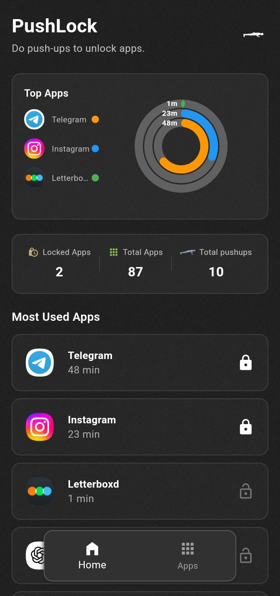
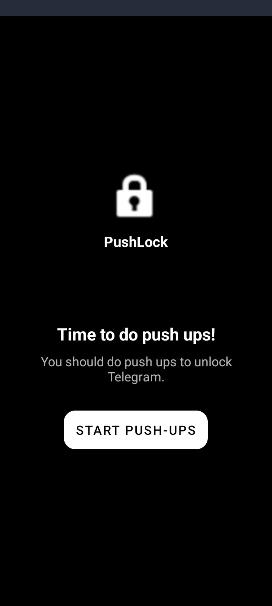
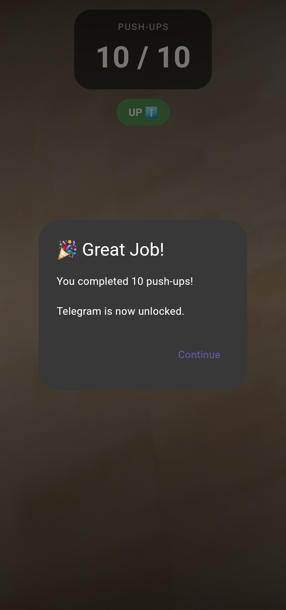

# PushLock 

**Stay fit while staying focused** - An innovative Android app that gamifies digital wellness by requiring push-ups to unlock distracting apps.

## Overview

PushLock is a Flutter-based productivity app that helps you break phone addiction and build healthy habits. When you try to open a locked app, you'll need to complete a set of push-ups detected by your camera and AI pose detection before gaining access. Track your progress, build streaks, and transform screen time into workout time.

## Features

- **Smart App Locking**: Select and lock distracting apps (social media, games, etc.)
- **AI-Powered Push-up Detection**: Uses Google ML Kit pose detection to count real push-ups
- **Progress Tracking**: Monitor your daily push-up count and app usage statistics
- **Beautiful UI**: Modern, dark-themed interface with smooth animations
- **Background Service**: Continuously monitors foreground apps even when PushLock is closed
- **ession History**: Track your workout sessions with detailed charts and analytics
- **Boot Persistence**: Automatically starts monitoring after device restart

## Tech Stack

### Frontend
- **Flutter** - Cross-platform UI framework
- **BLoC Pattern** - State management with flutter_bloc
- **Hive** - Local database for caching and persistence
- **Lottie** - Smooth animations

### Backend & Native
- **Kotlin** - Android native code for system-level features
- **Foreground App Detection** - Monitors currently active apps
- **Overlay System** - Custom lock screen overlay

### AI & Computer Vision
- **Google ML Kit** - Pose detection for push-up counting
- **Camera Plugin** - Real-time video processing

### Key Dependencies
- `flutter_accessibility_service` - App usage monitoring
- `flutter_overlay_window` - Lock screen overlay
- `google_mlkit_pose_detection` - Push-up detection
- `syncfusion_flutter_charts` - Data visualization
- `installed_apps` - App management

## 📱 Screenshots

<div align="center">
  
  
  
</div>

## Getting Started

### Prerequisites

- Flutter SDK (3.10.3 or higher)
- Android Studio / VS Code
- Android device or emulator (API level 21+)

### Installation

1. Clone the repository
```bash
git clone https://github.com/yourusername/pushlock.git
cd pushlock
```

2. Install dependencies
```bash
flutter pub get
```

3. Run the app
```bash
flutter run
```

### Required Permissions

PushLock requires the following permissions to function:
- **Accessibility Service** - Monitor foreground apps
- **Overlay Permission** - Display lock screen
- **Camera** - Detect push-ups
- **Usage Stats** - Track app usage

## Project Structure

```
lib/
├── main.dart                    # App entry point
├── homePage/                    # Home screen with stats
│   ├── bloc/                    # BLoC state management
│   └── widgets/                 # Reusable widgets
├── appsPage/                    # App selection screen
├── cameraPage/                  # Push-up detection screen
├── overlayPage/                 # Lock screen overlay
├── permissionsPage/             # Permission requests
├── introPage/                   # Onboarding flow
├── model/                       # Data models
├── repositories/                # Data layer
├── service/                     # Business logic
└── data/                        # Local storage

android/
└── app/src/main/kotlin/         # Native Android code
    ├── MainActivity.kt
    ├── ForegroundAppDetector.kt
    ├── OverlayUi.kt
    └── BootReceiver.kt
```

## 🎮 How It Works

1. **Setup**: Select apps you want to lock and grant necessary permissions
2. **Detection**: Background service monitors when you open a locked app
3. **Challenge**: Lock screen appears, prompting you to do push-ups
4. **Verification**: Camera uses AI to count valid push-ups
5. **Unlock**: Complete the required push-ups to access the app
6. **Track**: View your progress and statistics on the home screen

## 🤝 Contributing

Contributions are welcome! Please feel free to submit a Pull Request.

1. Fork the project
2. Create your feature branch (`git checkout -b feature/AmazingFeature`)
3. Commit your changes (`git commit -m 'Add some AmazingFeature'`)
4. Push to the branch (`git push origin feature/AmazingFeature`)
5. Open a Pull Request

## 📄 License

This project is licensed under the MIT License - see the LICENSE file for details.

## 🙏 Acknowledgments

- Google ML Kit for pose detection
- Flutter team for the amazing framework
- All contributors and testers

## 📧 Contact

For questions or feedback, please open an issue on GitHub.

---

**Built with ❤️ and 💪 using Flutter**
